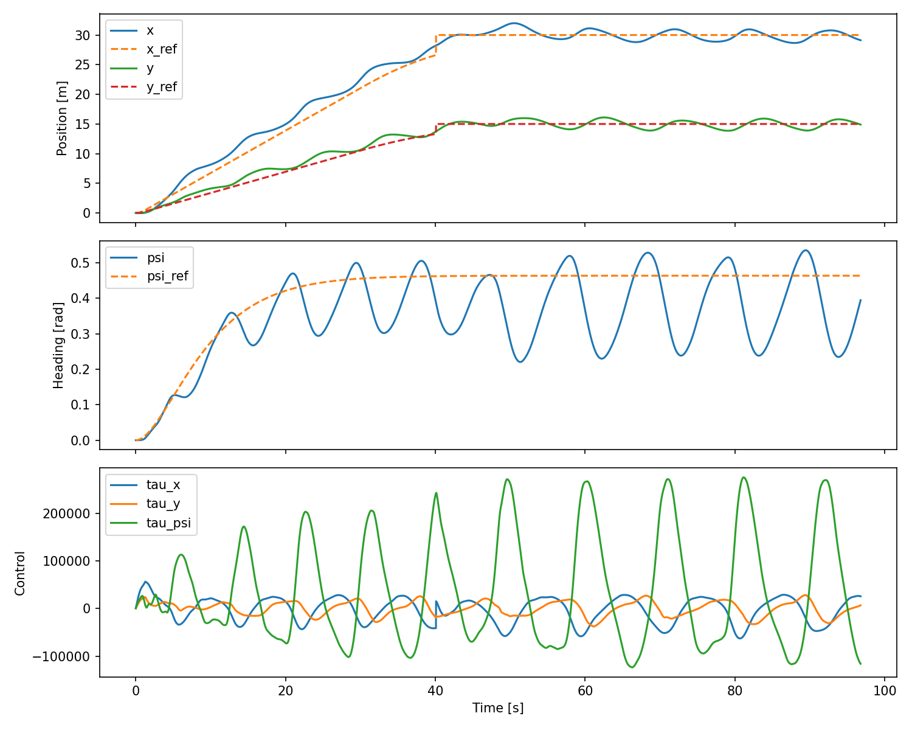

# Dynamic Positioning System - 3-DOF Vessel Control

Real-time dynamic positioning (DP) simulation for a surface vessel using PID + model-based feedforward control, built on the AGX Dynamics physics engine. Developed for *Simulation of Maritime Systems* (MMA4005) at NTNU.

The system controls surge, sway, and yaw to track reference trajectories and hold position under hydrodynamic disturbances.



---

## System Architecture

The DP stack runs as a closed-loop callback inside AGX. Each time step executes:

```
                      ┌─────────────────┐
                      │    main.py       │
                      │  (entry point)   │
                      └────────┬─────────┘
                               │
                      ┌────────▼─────────┐
                      │    runner.py      │
                      │  (simulation     │
                      │   loop & config)  │
                      └──┬──────┬─────┬──┘
                         │      │     │
              ┌──────────▼──┐ ┌─▼───┐ ┌▼──────────┐
              │  vessel.py  │ │ /   │ │  world.py  │
              │  hull model,│ │ctrl │ │  water,    │
              │  thrusters, │ │     │ │  waves,    │
              │  collisions │ │     │ │  terrain   │
              └─────────────┘ └──┬──┘ └────────────┘
                                 │
          ┌──────────┬───────────┼───────────┬────────────┐
          │          │           │           │            │
     ┌────▼───┐ ┌────▼────┐ ┌───▼────┐ ┌────▼─────┐ ┌───▼────────┐
     │observer│ │reference│ │control-│ │allocation│ │apply forces│
     │  state │ │  path & │ │  ler   │ │  pseudo- │ │  body→world│
     │  est.  │ │ heading │ │PID+FF  │ │ inverse  │ │  transform │
     └────────┘ └─────────┘ └────────┘ └──────────┘ └────────────┘
```

**DP loop per time step:**
1. **Measure** - read vessel pose (x, y, psi) from simulation
2. **Reference** - compute smooth target trajectory (position + heading)
3. **Observe** - estimate state using simplified Kalman filter
4. **Control** - PID + feedforward computes generalized forces/torques
5. **Allocate** - pseudo-inverse maps forces to individual thruster commands
6. **Apply** - rotate body-frame forces to world frame and apply at thruster points

---

## Control System

### Control Law

PID controller with model-based feedforward:

$$\tau = M\dot{\nu}_r + D\nu_r + K_p\tilde{\eta} + K_d\tilde{\nu} + K_i\int\tilde{\eta}\,dt$$

| Symbol | Meaning |
|--------|---------|
| M, D | Diagonal mass/inertia and linear damping matrices |
| nu_r, nu_dot_r | Reference body-frame velocities and accelerations |
| eta_tilde | Pose error (world frame): eta_r - eta_hat |
| nu_tilde | Velocity error (body frame): nu_r - nu_hat |
| K_p, K_d, K_i | Proportional, derivative, and integral gain matrices |

The feedforward term (M * nu_dot_r + D * nu_r) compensates for known dynamics so the PID only has to handle the residual error.

### Implementation Details

- **Anti-windup**: integral term only accumulates when actuators are not saturated
- **Saturation limits**: force/torque outputs clipped to physical thruster capacity
- **Heading wrap**: yaw error wrapped to [-pi, pi]

### Thruster Allocation

Two stern thrusters. The allocator uses the pseudo-inverse of the thruster configuration matrix:

```
tau = T @ f    →    f = pinv(T) @ tau
```

Where tau = [Fx, Fy, Mz] and f = [Fx1, Fy1, Fx2, Fy2].

---

## Results

100-second simulation run. The vessel tracks a path to (30, 15) m with a heading change to ~0.46 rad.

**Position tracking** (top): the vessel reaches the target position. Oscillations are present throughout due to underdamped gains.

**Heading tracking** (middle): heading oscillates around the reference without converging. This is the weakest axis and the gains need retuning.

**Control effort** (bottom): forces remain within saturation limits. The oscillatory pattern in tau_psi corresponds to the heading oscillations.

### Current Limitations

- PID gains were not fully tuned due to course time constraints
- The controller treats each DOF independently while the vessel dynamics are coupled
- Heading control needs further work
- No external disturbances (wind, current) modeled yet

### Vessel Model

The simulation uses a 3D model of the R/V Gunnerus research vessel with hydrodynamic surface interaction (waves, buoyancy).

---

## Project Structure

```
src/
├── main.py                  # Entry point, launches AGX simulation
├── plot_log.py              # Post-run plotting of logged data
├── agx_wrap/
│   └── world.py             # Water, waves, terrain, camera setup
├── control/
│   ├── controller.py        # PID + feedforward controller
│   ├── allocation.py        # Thruster force allocation (pseudo-inverse)
│   ├── observer.py          # State estimator (simplified Kalman filter)
│   └── reference.py         # 2nd-order trajectory and heading reference
├── modeling/
│   └── vessel.py            # Rigid body hull, thruster placement, force application
└── runtime/
    ├── runner.py             # Simulation loop, DP callback, logging
    └── config.py             # Vessel parameters, PID gains, scene config
assets/
└── Gunnerus.obj             # R/V Gunnerus 3D mesh
```

---

## Built With

- [AGX Dynamics](https://www.algoryx.se/agx-dynamics/) - multi-physics simulation engine
- Python 3.9, NumPy, Matplotlib, Pandas, PyYAML
- Blender (R/V Gunnerus 3D model)

## Acknowledgments

Developed for MMA4005 *Simulation of Maritime Systems* at NTNU, December 2025.
